# Fischer Framework

A lightweight Service Locator + Command/Mediator/Event architecture for Unity. It gives you a single place to register game-wide services (audio, haptics, logging, pooling, prefs, state machines, tweening), a `Notify(key, IEvent)` pub/sub bus that decouples UI/view code from game logic and a `[BindEvent]`-driven Command layer so gameplay logic can react to named events without either side knowing about the other directly.

Package id: `com.gambit.framework` · Version: `1.0.0` (from `package.json`)

## Badges


No license badge is included — see [License](#license).

## Core Concepts

### Service

Anything the framework offers (audio, haptics, pooling, prefs, state, tweening, your own gameplay systems) is a `IService` registered with `[Service]` and resolved through `ServiceLocator`. Services are discovered by reflection at boot and can be eager or lazy.

```csharp
[Service]
public class ExampleService : ServiceBase, IExampleService 
{
    public void OnInit() 
    {
        // ...
    }
}

```

or

```csharp
[Service]
public class ExampleService : MonoServiceBase, IExampleService 
{
    public void OnInit() 
    {
        // ...
    }
}

```  

### Command

A `Command` is a self-contained unit of game logic. Tag it with `[BindEvent("SomeKey")]` and it's auto-instantiated and executed whenever that key is notified — no manual wiring. `CommandChain`/`CommandGroup` compose several commands into one.

```csharp
[BindEvent("OnExampleEvent")]
public class ExampleCommand : CommandBase
{
    protected override void OnExecute(IEvent e = null) 
    {
        if (e is ExampleEvent exampleEvent) 
        {
            // ...
        }
    }
}
```

### Mediator

A `MediatorBase` is a `MonoBehaviour` that bridges Unity's scene/UI world and the event bus. It never references services or commands directly — it only listens and notifies.

```csharp
protected override void AddListeners() 
{
    AddListener("OnExampleEvent", OnExampleEvent)
    // ...
}

protected override void RemoveListeners() 
{
    RemoveListener("OnExampleEvent", OnExampleEvent)
    // ...
}

private void OnExampleEvent(IEvent e = null) 
{
    if (e is ExampleEvent exampleEvent) 
    {
        // ...
    }
}
```

### Event

`IEvent` is an empty marker interface — payloads are plain classes implementing it. The bus (`IEventLayer`, backed by `EventDispatcherService`) uses string keys instead of a central enum.

```csharp
Notify("OnIntExampleEvent", new ExampleEvent { Value = 10 });
Notify("OnFloatExampleEvent", new ExampleEvent { Value = 10f });
Notify("OnStringExampleEvent", new AnotherExampleEvent { Value = "example string" });
```

### Pooling

`IPoolService` pools world-space `GameObject`s; `IRectService` does the same for UI `RectTransform`s. Pool keys come from a `PoolMediator` on the prefab, so `Dequeue`/`Enqueue` are the normal entry points.

```csharp
var obj = Dequeue(prefab, spawnPosition);
```

### State (State Machine)

A minimal keyed state machine: `IMachine` holds named `IState`s, and `IStateService` owns one machine per `StateData` asset. States fire `UnityEvent`s (`OnEnter`/`OnExit`/`OnUpdate`) instead of requiring subclassing.

```csharp
SetState("Player", "Idle");
```

### Other systems

- **Variable** — `ScriptableObject`-backed reactive value types (`BoolVar`, `FloatVar`, `StringVar`, etc.)
- **Tween** — a lightweight fluent tweening system with `Transform`/`RectTransform`/`Material`/`Slider` extensions
- **Prefs** — `PlayerPrefs` wrapper with generic `GetPref<T>`/`SetPref<T>`
- **Log** — leveled logging with an in-memory history dump
- **Async** — schedule work onto `Update`/`FixedUpdate`/`LateUpdate` or run coroutines from non-`MonoBehaviour` code
- **Haptic** — cross-platform haptic feedback (native Android/iOS, editor no-op)
- **Singleton** — a lazy `FindFirstObjectByType` `MonoBehaviour` singleton base

## Installation

This repository is a full Unity project — `package.json` lives at `Assets/Gambit/Framework/package.json`, not at the repo root. Install it as a UPM git package using the `?path=` query so Unity resolves the subfolder:
**Unity Package Manager UI:** Window → Package Manager → `+` → *Add package from git URL…*

```
https://github.com/mertcolakogl/framework.git?path=Assets/Gambit/Framework
```

**Or add directly to `Packages/manifest.json`:**

```json
{
  "dependencies": {
    "com.gambit.framework": "https://github.com/mertcolakogl/framework.git?path=Assets/Gambit/Framework"
  }
}
```

Requires Unity **6000.0** or later (developed against `6000.0.77f1`, per `package.json`).

> ⚠️ **Odin Inspector must be installed first** — see [Optional Dependencies](#optional-dependencies) below. `package.json` declares no dependencies (`"dependencies": {}"`), but the source currently does not compile without Odin.

## Quick Start

A minimal slice: a `ScoreService`, a `Command` that adds to the score, and a `Mediator` that fires the event from a button click. This is an illustrative example built from the real interfaces above, not a file copied from the repo.

**1. A service**

```csharp
using Gambit.Framework.Scripts.Core.ServiceLocator.Attributes;
using Gambit.Framework.Scripts.Core.ServiceLocator.Interface;

public interface IScoreService : IService
{
    int Score { get; }
    
    void Add(int amount);
}

[Service]
public class ScoreService : IScoreService
{
    public int Score { get; private set; }
    
    public void OnInit() 
    {
        // ...
    }
    
    public void Add(int amount) 
    {
        Score += amount;
    }
}
```

**2. An event payload + a command bound to it**

```csharp
using Gambit.Framework.Scripts.Core.Command.Behaviour;
using Gambit.Framework.Scripts.Core.Event.Attributes;
using Gambit.Framework.Scripts.Core.Event.Interface;

public class ScoreEvent : IEvent
{
    public int Amount;
}

[BindEvent("OnAddScore")]
public class AddScoreCommand : CommandBase
{
    protected override void OnExecute(IEvent e = null)
    {
        if (e is ScoreEvent scoreEvent) 
        {
            Of<IScoreService>().Add(scoreEvent?.Amount ?? 0);
        }
    }
}
```

**3. A mediator that triggers it**

```csharp
using Gambit.Framework.Scripts.Core.View;
using UnityEngine;
using UnityEngine.UI;

public class ScoreButtonMediator : MediatorBase
{
    [SerializeField] private Button addScoreButton;

    protected override void AddListeners() 
    {
        addScoreButton.onClick.AddListener(OnAddScoreClicked);
    }
    
    protected override void RemoveListeners() 
    {
        addScoreButton.onClick.RemoveListener(OnAddScoreClicked);
    }

    private void OnAddScoreClicked() 
    {
        Notify("OnAddScore", new ScoreEvent { Amount = 10 });
    }
}
```

Nothing else to wire up: `ServiceLocator` finds `ScoreService` via `[Service]`, `CommandService` finds `AddScoreCommand` via `[BindEvent]` and clicking the button drives the whole chain through `Notify` → `EventDispatcherService` → `AddScoreCommand.Execute` → `ScoreService.Add`.

## Architecture Diagram

```mermaid
flowchart LR
    subgraph Scene
        Mediator["MediatorBase\n(MonoBehaviour)"]
    end

    subgraph EventBus["Event Bus"]
        EDS["EventDispatcherService\n(IEventDispatcherService)"]
    end

    subgraph CommandLayer["Command Layer"]
        CS["CommandService\n([BindEvent] scanner)"]
        Cmd["CommandBase subclass\n(ICommand)"]
    end

    subgraph Services["Service Locator"]
        SL["ServiceLocator\n([Service] registry)"]
        Svc["Your IService"]
    end

    Mediator -- "Notify(key, IEvent)" --> EDS
    EDS -- "invokes listener for key" --> CS
    CS -- "Activator.CreateInstance + Execute(e)" --> Cmd
    Cmd -- "Of&lt;T&gt;()" --> SL
    SL -- "resolves" --> Svc
    Svc -. "OnInit() at boot / first Of&lt;T&gt;()" .-> SL
```



## Optional Dependencies

Odin Inspector is currently a **hard** dependency, not an optional one: `GenericVar.cs`, `StateRunner.cs`, and `TweenDataBase.cs` import `Sirenix.OdinInspector` unconditionally, with no `#if ODIN_INSPECTOR` guard. If Odin isn't installed in the consuming project, the package won't compile and `package.json` won't warn you since it declares no dependencies. If the intent is for Odin to be optional, those three files still need the guard added.

## Versioning Policy

Standard SemVer. Public API surface = every `Interface` (`IService`, `ICommand`, `IEventLayer`, etc.) plus abstract/virtual members on base classes (`CommandBase`, `MediatorBase`, `ServiceBase` and similar). Breaking that surface is MAJOR, additive changes are MINOR, behavior-preserving fixes are PATCH.

## Contributing

This is an internal framework (no `CONTRIBUTING.md` or issue templates in the repo). For changes, questions, or access, contact the maintainer:

**Mert Colakoglu** — mert@gambitgamestudio.com

## License

No `LICENSE` file is present in this repository. Every source file's header states *"Copyright (c) 2026 Mert Colakoglu. All rights reserved."* — treat this package as proprietary/all-rights-reserved until a license file is added; do not redistribute without checking with the author first.